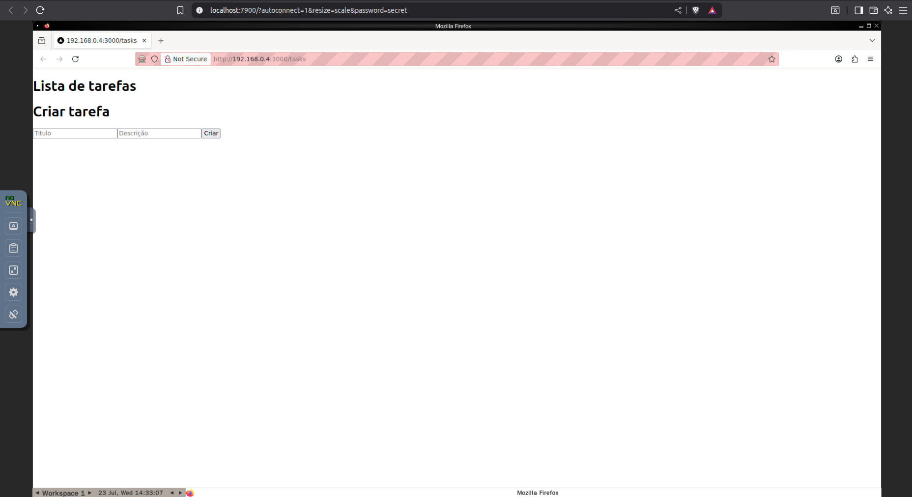

# Selenium Django Next.js Project

This project demonstrates integration testing for a Django backend and a Next.js frontend using Selenium. It includes a CI workflow with GitHub Actions for automated test execution.

---

## Features

- **Backend:** Django REST API for task management.
- **Frontend:** Next.js application for interacting with tasks.
- **Testing:** End-to-end tests using Selenium WebDriver (local or remote).
- **CI:** Automated tests via GitHub Actions.
- **Selenium Grid:** Easily run tests using Selenium Grid via Docker Compose.
- **Live Selenium Execution:** When using the `selenium/standalone-firefox` image, you can view the browser execution at [http://localhost:7900/?autoconnect=1&resize=scale&password=secret](http://localhost:7900/?autoconnect=1&resize=scale&password=secret).

---

## Local Development Setup

### 1. Clone the repository

```sh
git clone <repo-url>
cd selenium-django-nextjs
```

### 2. Backend Setup

Install Python dependencies:

```sh
pip install -r requirements.txt
```

Run database migrations:

```sh
python manage.py migrate
```

### 3. Frontend Setup

Install Node.js dependencies:

```sh
cd frontend
npm install
```

---

## Running Locally

### 1. Start the Frontend

```sh
cd frontend
npm run dev
```

### 2. Get Your Local IP Address

On Linux, run:

```sh
hostname -I | cut -d ' ' -f1
```

Copy the resulting IP address (e.g., `192.168.1.100`).

### 3. Set Environment Variables

#### Frontend

Edit `.env` in the `frontend` folder and set:

```
NEXT_PUBLIC_API_URL=http://<YOUR_IP>:8000
```

#### Backend (for tests)

Set environment variables before running tests:

```sh
WEBDRIVER=REMOTE FRONTEND_URL=http://<YOUR_IP>:3000 python manage.py test
```

Replace `<YOUR_IP>` with the IP from step 2.

---

## Selenium Grid & Remote WebDriver

You can run Selenium Grid using Docker Compose. The provided `docker-compose.yml` includes the `selenium/standalone-firefox` service:

```yaml
services:
  selenium:
    image: selenium/standalone-firefox
    ports:
      - 4444:4444
      - 7900:7900
```

Start Selenium Grid:

```sh
docker compose up -d
```

- **WebDriver URL:** `http://localhost:4444/wd/hub`
- **Live Browser View:** [http://localhost:7900/?autoconnect=1&resize=scale&password=secret](http://localhost:7900/?autoconnect=1&resize=scale&password=secret)



---

## Running Tests

After starting the frontend and Selenium server, run:

```sh
WEBDRIVER=REMOTE FRONTEND_URL=http://<YOUR_IP>:3000 python manage.py test
```

---

## Docker

### Build the Frontend Container

```sh
cd frontend
docker build -t nextjs-docker .
```

### Run the Frontend Container

```sh
docker run -p 3000:3000 nextjs-docker
```

---

## Continuous Integration (CI)

GitHub Actions workflow is provided in `.github/workflows/ci.yml` to automate tests on push and pull requests.

---

## Notes

- Always use your machine's IP address for `FRONTEND_URL` and `NEXT_PUBLIC_API_URL` when running Selenium tests remotely.
- The backend tests use Selenium to interact with the frontend, so both must be running and accessible.
- You can visually monitor Selenium test execution at [http://localhost:7900/?autoconnect=1&resize=scale&password=secret](http://localhost:7900/?autoconnect=1&resize=scale&password=secret) when using the provided Docker setup.
